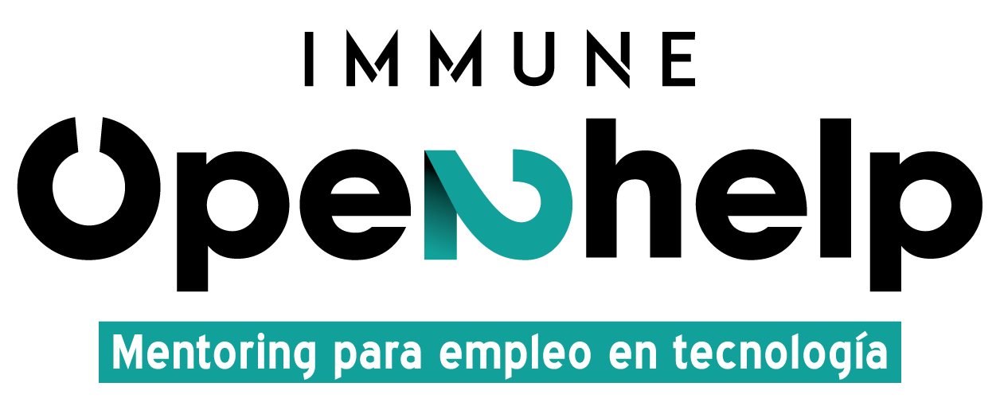

# Open2Help

Mentorías gratuitas con el/la mentee escogido por ti

### Objectivos 

Open2Help nace de la idea de ayudar a personas que necesiten apoyo de cara a su reincorporación al mercado laboral tecnológico

### Método

En la plataforma gratuita encontrarás a profesionales en posiciones de liderazgo en las áreas de conocimiento disponibles

Dichos profesionales donarán como mínimo 60 minutos de su tiempo al mes para mentorizarte en el área de conocimiento que hayas escogido

## Run Locally

Clonar proyecto | Clone project
```bash
git clone https://github.com/PedroGGBM/Open2Help.git
```

Ir al directorio del proyecto | Move to project directory
```bash
cd Open2Help
```

Crear y activar entorno virtual | Setup virtual environment
```bash
python3 -m venv env

source env/bin/activate
```

Instalar dependencias | Install dependencies
```bash
pip install -r requirements.txt
```

Para ejecutar servidor Django | Execute Django server (automatic)
```bash
python3 open2help/manage.py runserver
```

## Opcional [Modificaciones]

Actualizar requisitos/dependencias | Update requirements/dependencies
```bash
python -m pip freeze > requirements.txt
```

## License

[](https://opensource.org/licenses/)

Copyright © IMMUNE Technology Institute - All rights reserved

## Autores

- [@Lunat12](https://github.com/Lunat12)
- [@Ermys-Code](https://github.com/Ermys-Code)
- [@ElDodas](https://github.com/ElDodas)
- [@juanboscop](https://github.com/juanboscop)
- [@CamiloGC24](https://github.com/CamiloGC24)
- [@GloriaFlores03](https://github.com/GloriaFlores03)
- [@Villaaz](https://github.com/Villaaz)
- [@EmiliooAlvarez](https://github.com/EmiliooAlvarez)
- [@JoseRicoK](https://github.com/JoseRicoK)
- [@jaime1742](https://github.com/jaime1742)
- [@PedroGGBM](https://github.com/PedroGGBM)
